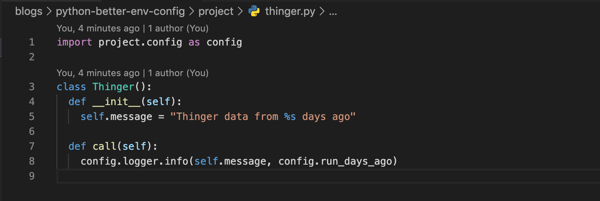

I recently started a Python project. I’ve only done a very small amount of Python in my career, and so learning the best practices of Python on the fly has been a real struggle. One of my biggest learning moments was understanding appropriate ways to manage environment configuration. This was compounded by the fact that I was working with AWS services, requiring my local development environment to differ from my staging and production environments.

## My Mistake
The mistake I made is that I grouped logic, behavior, configuration, and variables by environment. This meant that for each environment, I had a separate file that contained everything that “differed” from the primary workflows. When necessary, I would define the same function twice, but the underlying behavior depended on which file it lived in.

In practice, this allowed me to do one logical switch in the main application:

```py
if os.environ.get("ENVIRONMENT") == "dev":
    import environment.development as env
else:
    import environment.production as env
```
And then I could call `env.my_shared_function_name()` and it would magically do the correct behavior based on the `ENVIRONMENT` variable.

### That sounds… good? Why is it a mistake?
The shortfalls of this approach became very apparent when I started expanding the logic to incorporate additional functionality. And it compounded when I decided that I needed to extract the logic into modules and let main only be the control or distribution center.

#### Some of the shortfalls
1. **Unnecessary Duplication**: In some cases, I needed to duplicate and define configuration variables across all environments, even if it was only used for one of them. In other cases, I needed to duplicate and define configuration variables for all environments, even if they were identical in all of them.
2. **Where does it live?** While the main tree of logic may have been “clean,” reading some functions as `myFunction()` and others as `env.someOtherFunction()` meant that I was opening and searching through multiple files to trace the logic every time I hit one of those special env functions. This caused a lot of cognitive overhead to understand what was going to happen and when and why… and I WAS THE PRIMARY DEVELOPER.
3. **Variables or Functions?** Since things were grouped by environment, this meant that a single file was housing potentially unrelated logic trees, variables, functions, and behavior. 😱

### Environment Configuration vs Environment Behavior
The biggest takeaway from these shortfalls was understanding that I was confusing and muddling the difference between environment configuration and environment behavior. I was letting the runtime environment of the script dictate both; grouping them together as if it was all configuration.

Once I separated the configuration from behavior, per environment, it became apparent the separation of concerns and what needed to change.

## Refactoring for Fewer Headaches

This exercise led to a refactor to reduce the cognitive overhead and correctly separate configuration from behavior.

I followed a three step refactor pattern:

1. Define Configuration vs Behavior
2. Logically gate behavior in-place
3. Create a Configuration module

### 1. Defining Configuration vs Behavior
Before I could really dive in, I wanted to make sure that I really understood the difference between my configuration and behavior. I went through each file and separated it into buckets:

1. environment variables (such as information fetched with os.environ.get()),
2. environment configuration (variables I define, such as script-defined defaults or variables created from other environment variables),
3. and behavior (such as functions and helpers).

### 2. Logically gate behavior in-place
Now that we know what our behavior is, we can replace where we had previously called env.functionName() and logically gate it instead:

| Before | After |
| --- | --- |
| 
# in environments/development.py
def write_data_row():
    # write csv

# in environments/production.py
def write_data_row():
    # write json

# in main.py
if os.environ.get("ENVIRONMENT") == "dev":
    import environment.development as env
else:
    import environment.production as env

def extract():
    env.write_data_row()
 | 
# in main.py
def write_data_row():
    # This call to os will eventually change to config
    if os.environ.get("ENVIRONMENT") == "dev":
        # write csv
    else:
        # write json

def extract():
    write_data_row()
 |

Now, all of the behavior inherent to extract() and write_data_row() is contained in the same class and file. So much easier to follow the logic!

> #### 💡 Further Refactor Opportunity
> It is important to note that while my refactor stopped here since the goal was to fix the configuration, you could continue down this path to further reduce or fully remove the need for logical gating entirely.
> One option is to formally support all known/necessary pathways. Following our example with writing a data row, we could formally support both file formats with format defined in configuration. Depending on your use cases and needs, this will vary.

### 3. Create a Configuration module
So now that all I have left is my environment variables and some environment configuration, how do I organize it in a way that makes sense? I decided that creating a configuration module was a good way to separate the configuration from the main logic, while also providing an interface for overriding if necessary.

#### Defining the module
In my project route, I created a new module specifically for configuration:

```
project/
├── config/           # config folder
│   └── __init__.py   # made a module with this file
└── main.py
```
And then I added all of my environment variables into `__init__.py`:

```py
import os
from datetime import datetime, timedelta

# Default run environment
env = os.environ.get("ENVIRONMENT") or "dev"
```

along with some of my script-specific defaults:
```py
# Default Days Ago
run_days_ago = 1

# Default Run Day
day = datetime.today() - timedelta(days=run_days_ago)

logger = logging
logger.getLogger().setLevel(logging.INFO)
```
#### Using the module
Since it’s a module, whenever you import config, all of your environment configuration is loaded and ready to use:

```py
import project.config as config

config.env == "dev"
#> True
```
## Benefits of this Approach
Configuration is override-able and import-able with those overrides in effect. Let’s take, for example, the default run day configuration.

Given this file structure:
```
root/
├── project/
│   ├── __init__.py
│   ├── thinger.py
│   └── config/
│       └── __init__.py
└── main.py
```
I can do the following, with the configuration:

```py
# in main.py
import project.config as config

config.run_days_ago = 5

from project import Thinger

def main():
  Thinger().call()
```

```py
# in project/thinger.py
import project.config as config

class Thinger:
  def __init__(self):
    self.message = "Thinger data from %s days ago."

  def call(self):
    config.logger.info(self.message, config.run_days_ago)
```
And if we were to run this program:
```sh
$ python main.py
INFO:root:Thinger data from 5 days ago
```
## Final Thoughts
This final example is available in my snippets repository.

This can be super powerful for changing various configurations at runtime. It also ensures that anything that is overwritten at runtime propagates to all of the places that import and use that configuration, so long as you do the overwriting before you import those modules.

Do you have other ways of managing environments in your Python projects?